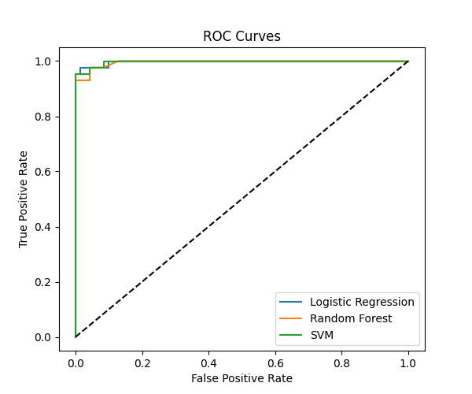
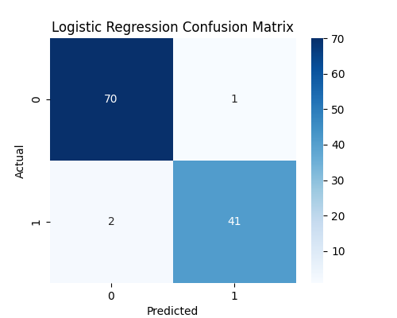

# Breast Cancer Predictor  

A Python-based **command-line and web-ready ML application** to predict breast cancer using **Logistic Regression, Random Forest, and SVM**. The project uses the Breast Cancer dataset and provides **predictions, model evaluation metrics, confusion matrices, and ROC curves**.  

---

## Features  

- Predicts whether a tumor is **Benign** or **Malignant** using all features from the dataset.  
- Uses **StandardScaler** for feature scaling.  
- Trains and saves **Logistic Regression, Random Forest, and SVM models**.  
- Performs **hyperparameter tuning** for Random Forest.  
- Generates and saves:  
  - Confusion matrices for all models  
  - ROC curves for all models  
- Ready for integration into a **Flask web application** for interactive predictions.  

---

## Model Evaluation (Example)

| Model                  | Accuracy | Precision | Recall | F1-score | ROC-AUC |
|------------------------|----------|-----------|--------|----------|---------|
| Logistic Regression    | 97.37%   | 97.62%    | 95.35% | 96.47%   | 0.9974  |
| Random Forest          | 96.49%   | 97.56%    | 93.02% | 95.24%   | 0.9971  |
| SVM                    | 98.25%   | 100.00%   | 95.35% | 97.62%   | 0.9971  |

  


---

## Installation  

1. Clone the repository:  
```bash
git clone https://github.com/Yovinne-Shadora-data/Breast_Cancer_Predictor.git

2. Navigate to the project folder:
cd Breast_Cancer_Predictor
3. Create a virtual environment:
python -m venv venv
4. Activate the virtual environment:
venv\Scripts\activate
5. Install dependencies
pip install -r requirements.txt

Usage
Step 1: Train and evaluate models
python src\models\train_model_upgrade.py

.Trains Logistic Regression, Random Forest, and SVM

.Saves models in src/models/

.Generates confusion matrices and ROC curves

.Prints evaluation metrics in CMD

Step 2: Open generated plots
start src\models\logistic_regression_confusion_matrix.png
start src\models\random_forest_confusion_matrix.png
start src\models\svm_confusion_matrix.png
start src\models\roc_curves.png

Project Structure
Breast_Cancer_Predictor/
├── data/
│   └── breast_cancer.csv       # Dataset
├── src/
│   ├── models/
│   │   ├── logistic_regression.pkl
│   │   ├── random_forest.pkl
│   │   ├── svm.pkl
│   │   ├── scaler.pkl
│   │   ├── logistic_regression_confusion_matrix.png
│   │   ├── random_forest_confusion_matrix.png
│   │   ├── svm_confusion_matrix.png
│   │   └── roc_curves.png
│   └── train_model_upgrade.py   # Training and evaluation script
├── static/                     # Optional for Flask
├── templates/                  # Flask HTML templates
├── requirements.txt
└── README.md

License

MIT License

Author

Yovinne Shadora